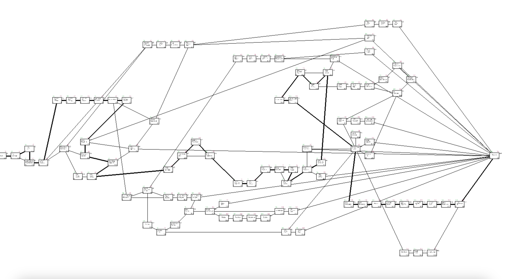

## Critical Path Method Visualiser

I wrote this little program in C with SDL3 for a project in my Engineering class. To compile it, run the `make.sh` script. The program should automatically start if the compilation doesn't fail.

The program automatically saves your node configuration to the node\_pos.bin file. I've included my own configuration, but if you want to default to the automatically generated layout (worse), delete or rename it.

The data is held inside the raw\_data.csv file. If you modify it, be sure to delete the node\_pos.bin file as it is invalid now.

To zoom, scroll in and out. Pan around the area by holding left mouse and dragging. Reposition nodes by holding shift and dragging one.

This isn't designed to be expandable, so the main file is pretty messy, just a heads up.

Let me know if you have any problems! ^^
